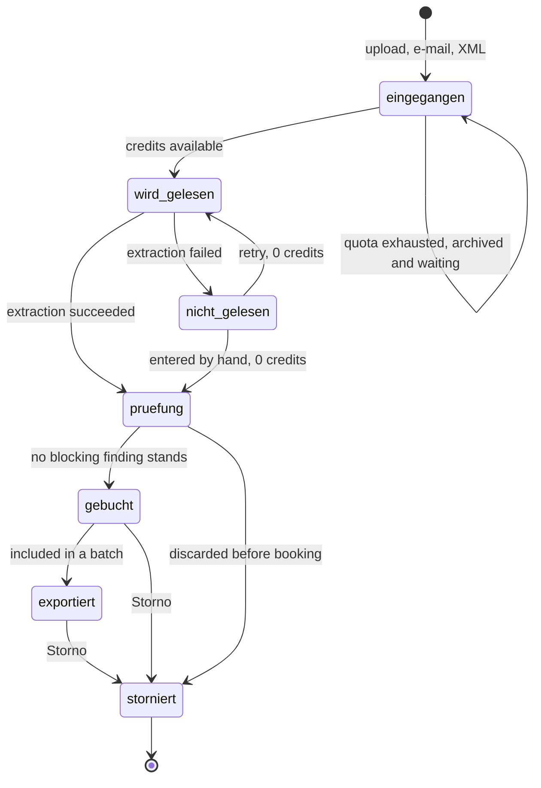

# GastroBeleg — flows, scenarios and the working agreement

Audience: the CTO, whoever builds Phase 1, and the coding agent either of them
runs. `MVP.md` says *what ships*. This file says *what happens* — the order of
events, the states a document can be in, which screen follows which, and where
a flow is allowed to end.

It exists because the three documents that came before it each answer a
different question and none of them answers this one. Screens were listed but
never sequenced; validation rules were specified but the branch after a finding
was not; roles were tabulated but the route from an invitation to a denied deep
link was not. Every hole found in the flow audit of 19.08.2026 was a *step*,
not a screen — which is the argument for writing the steps down.

---

## 0. Which document wins

Read this order once, at the start of a session. It is short on purpose.

| # | Document | Authority over |
|---|---|---|
| 1 | `CLAUDE.md` | Product definition, German domain rules, stack, conventions. **Nothing overrides it.** Loaded automatically by Claude Code. |
| 2 | `MVP.md` | Scope: what is in, what is out, the data model, the build order, the closed decisions. |
| 3 | **`FLOWS.md`** (this file) | Behaviour between screens: states, transitions, scenarios, navigation, credit charging. |
| 4 | Figma page `V4 · Accent Lime` | Appearance and the exact German strings. `X5cmjr1EwurV8FrkN6BYxc`, page id `876:3651`. |
| 5 | `web/` | Data shapes and interaction patterns only. Its **styling is superseded** and 18 of its routes are Phase 2/3. |

Two frames inside Figma outrank prose:

- **`Rollen · Rechte-Matrix — Desktop`** is the permission truth. If code and
  that table disagree, the table is right — or it is changed there first.
- **`Read me first`** and **`Theme for globals.css`** on the same page carry the
  colour ramp, the four-step surface rule and the token names.

When two documents genuinely conflict, do not average them. Say which two,
quote both, and ask. A silent merge produces a product nobody decided on.

---

## 1. Working agreement for the coding agent

This section is the reason the file is in the repository rather than in a wiki.
An agent that reads only the code will reproduce the code's defaults, and the
expensive mistakes in this project have all been defaults that type-checked.

### 1.1 Before writing code

1. **Name the flow you are implementing.** Every task in Phase 1 belongs to one
   of the scenarios in §6. If it belongs to none, it is either out of scope
   (§2.3 of `MVP.md`) or the flow list is incomplete — resolve that first.
2. **Read the screen, do not imagine it.** Pull the real frame before building
   a UI surface. The Figma MCP is connected; `get_metadata` for structure,
   `get_design_context` for one node. Screen names in this file are the exact
   Figma frame names, so they can be searched literally.
3. **Check the state family.** Every list, every document type and every dead
   end has four states — empty, loading, error, partial (`MVP.md` §3d). A
   surface built with only its full state is half built and will come back.

### 1.2 The defaults that are wrong here

Each of these is something a competent agent does by habit, and each is a
defect in this codebase.

- **Guessing a VAT rate from the product category.** Food is usually 7 %, drinks
  usually 19 %, and the exceptions are numerous enough that a guess corrupts a
  tax return. Unknown is a valid value and it blocks booking.
- **Floats for money.** Integer cents everywhere. `unit_price` is the single
  exception and stays `Decimal` — it is a rate, and 1 000 napkins at 0,008 €
  is a real line that cent-rounding turns into a false validation failure.
- **Sending an XRechnung through the model** because one extraction path is
  tidier than two. The XML values are already exact; restating them can only
  introduce error, and it converts a free document into a billed one.
- **Editing an applied migration** to add an enum member. Migrations are
  forward-only; `DocumentType` is declared in full in the first one for exactly
  this reason.
- **Comparing a pack price against a per-base-unit history.** Resolve the
  mapping's `conversion_factor` first. This bug shipped in the prototype as
  `+424 %`, green on every type check.
- **Reading `web/` as a backlog.** It has eleven sidebar entries because it
  demonstrates Phase 2. The MVP has seven. Building eleven ships four dead ends.
- **Hiding a disabled action.** On a page a role may legitimately open, a
  forbidden action stays visible and disabled with who may perform it. Hiding it
  makes the page look broken (`MVP.md` §3f).
- **`·` as a separator, and glyph arrows or ticks in text runs.** `AI_rules.md`
  §8. Roughly 400 strings were rewritten to remove these; they are trivial to
  reintroduce in code.
- **Adding a status, a role or a sidebar entry.** All three sets are closed in
  this file and in `MVP.md`. Widening one is a decision, not an implementation
  detail.

### 1.3 Definition of done, as commands

```bash
uv run pytest                       # golden-file suite included, no network
uv run mypy && uv run ruff check .  # strict, no untyped domain logic
```

Plus, and this is not optional for anything with a screen: **look at it at
390 px on a real device.** The prototype's most expensive bugs were all visible
and none were caught by a type checker.

For extraction changes specifically the bar is higher: the golden suite passes
*and* the confidence distribution has not degraded. A change that raises average
confidence while getting more documents wrong is a regression.

### 1.4 Commits and branches

English, imperative, one reason per commit. Branch off `main`; `main` is the
default branch and the one that deploys. Never commit `.env` — it holds a live
API key and is gitignored at `.gitignore:9`. Staging and production carry
separate Stripe and model credentials.

---

## 2. Actors, and the scope every screen sits inside

Four roles, one tenant, and a global location scope that every list obeys.

| Role | In one sentence |
|---|---|
| **Owner** | Everything, including plan, billing and deletion. |
| **Manager** | Everything operational. May invite Staff, not Manager or Owner. No plan, no billing. |
| **Staff** | Uploads, and sees only their own uploads, without a single amount. |
| **Steuerberater** | Reads everything, exports everything, edits and books nothing. |

**The app shows one location at a time.** The switcher sits in the sidebar on
desktop and inside `Mehr — Mobile` on the phone, and every list, dashboard and
export follows it. There is deliberately no per-list location filter: two
screens showing different totals for the same month is a support ticket that
never closes. A document is assigned its location on the review screen,
defaulting to the uploader's home location. Staff's location is assigned, not
switchable.

**Staff sees upload states, never booking states.** Their statuses are *wird
gelesen, wird geprüft, erfasst, nicht gelesen* — enough to tell whether the
photo went through, and nothing about what the business spends. The money
column is absent everywhere on `Staff · Meine Uploads`.

---

## 3. The document lifecycle

This is the spine. Everything in §6 is a walk through this machine.



| Status | German label | Set by | Leaves when |
|---|---|---|---|
| `eingegangen` | In Warteschlange | intake | reading starts, or credits arrive |
| `wird_gelesen` | In Verarbeitung | pipeline | extraction returns or fails |
| `nicht_gelesen` | Nicht gelesen | pipeline | a person retries or types it in |
| `pruefung` | Zu prüfen | pipeline | a person books or discards it |
| `gebucht` | Gebucht | person | it enters an export batch, or is reversed |
| `exportiert` | Exportiert | export | Storno only |
| `storniert` | Storniert | person | terminal — it stays in the list |

Four properties of this machine are load-bearing.

- **Intake never stops.** A document that arrives with an empty credit balance
  is archived and stays retrievable; only *reading* pauses. § 147 AO does not
  care about our billing, and neither does the customer whose supplier just
  e-mailed an invoice.
- **`storniert` is not a delete.** No hard deletes of booked documents — soft
  delete plus Storno, and the reversed document keeps its place in the list on
  both platforms (`Belege · Storniert`).
- **A blocking finding is not a status.** It is a property of the document while
  it sits in `pruefung`. `Beleg buchen` is disabled and says why; the document
  does not move to a separate state, or the list grows a status per rule.
- **Rückfrage is a flag, not a status.** The Steuerberater can raise a question
  on a document that is already `gebucht` or `exportiert`, so it cannot be a
  point on this line. `rueckfrage_offen` is a boolean plus a note; it surfaces
  the document in the owner's review queue and renders
  `Beleg prüfen · Rückfrage` without moving it backwards.

The prototype's `DocumentStatus` in `web/src/lib/domain.ts` has four members.
It predates the states above and must be widened, not treated as the contract.

---

## 4. Where a credit is charged

The rate follows the source, never the line count — the restaurateur chooses
how a document reaches us, and cannot influence how many lines their supplier
prints (`CLAUDE.md` §2.5).

| Source | Credits |
|---|---|
| XRechnung / ZUGFeRD | 0 |
| `Kassenbeleg` at or under 250 € | 0.5 |
| Photo or PDF | 1 up to 60 lines, +1 per further 60 |
| Manual entry, and any retry after a failed read | 0 |

**The charge is written when extraction succeeds**, at the transition
`wird_gelesen → pruefung`, because that is the first moment the source, the
type, the total and the line count are all known. Three consequences the build
must not soften:

1. **A failed read is a zero-credit row, not a missing row.** Absence cannot be
   told apart from a bug, and „warum drei Credits?“ is a question the product
   has to be able to answer.
2. **A split writes compensating rows.** Changing the separation in
   `Modal · Trennung ändern` changes the number of documents, and a photo or PDF
   is charged per document. One cut more is one credit more; the editor shows
   that live, because a wrong split costs money *and* corrupts price history.
3. **Corrections are new rows, never edits.** `CreditCharge` is append-only, the
   same discipline the archive uses.

Two balances, consumed allowance first: the monthly allowance rolls one period
forward and is capped at one allowance; purchased top-ups never expire, not even
across a tier change. Merging them into one number makes the cap unenforceable
and the top-up promise unkeepable.

When the balance hits zero, reading pauses and the person meets
`Modal · Kontingent erschöpft — Desktop` or `Sheet · Kontingent erschöpft —
Mobile`. Documents keep arriving into `eingegangen` behind it.

---

## 5. The pipeline, and where a human can get in

```
intake → classify → split → extract → validate → map → review-if-needed → post
```

Every stage is idempotent and resumable, with a dead-letter queue for failures.
The rule that makes the queue honest: **a stage that cannot complete leaves the
document in a state a human can act on.** Never a silent drop, never a document
that exists in the archive and nowhere in the interface.

| Stage | Human exit when it fails | Screen |
|---|---|---|
| intake | file rejected at the door, with the reason and the size limit | `Modal · Beleg hochladen` |
| classify | treated as an image and read; misclassification is not fatal | — |
| split | the person corrects the separation | `Modal · Mehrere Belege erkannt` → `Modal · Trennung ändern` |
| extract | `nicht_gelesen`, with retry and type-it-in beside each other | `Belege · Verarbeitung und Fehler` |
| validate | findings on the review screen, blocking distinct from warning | `Beleg prüfen · Blockierende Prüfung` |
| map | unmapped line is a warning, not a block; mapping is a dialog | `Modal · Artikel zuordnen` |
| post | booking fails only on a stale conflict; the reason is shown | `Beleg prüfen` |

`classify` is a **security boundary, not only a cost one**: structured XML must
never reach a model. Two independent mistakes must be required to send a
document outside the EU, and that property has to survive refactoring
(`app/extraction/client.py` has no default route).

---

## 6. Scenarios

Eleven walks through the product. Together they cover every MVP screen; a task
that fits none of them is out of scope or a gap in this list.

Each carries an **acceptance** line. Those lines are the UAT script — they are
written so a person with the app in their hand can pass or fail them without
reading any other document.

---

### S1 — The core loop: a delivery note at six in the morning

**Owner or Manager, phone.** The product's entire proposition is this scenario
taking under a minute.

1. Goods arrive. The person opens the app on **`Übersicht — Mobile`** and taps
   the raised centre action, landing on **`Beleg scannen — Mobile`**.
2. They photograph the Lieferschein. Multiple pages are multiple captures in one
   batch. **`Hochladen — Mobile`** shows the queue.
3. The document appears in the list as *In Verarbeitung*. **The person is not
   held there** — this is the point of the status: they put the phone in their
   apron and carry crates.
4. Extraction finishes. The document moves to *Zu prüfen* and, if nothing is
   blocking, it can be booked without a single edit.
5. They open **`Beleg prüfen — Mobile`**, see the original beside the extraction,
   confirm, and tap `Beleg buchen`.
6. Booking writes price history, teaches the mapping, and — because a
   Lieferschein is not a Buchungsbeleg — **keeps the document out of the DATEV
   batch** unless the supplier carries `bills_by_delivery_note`.

**Goes wrong when:** no signal in the walk-in (`Beleg scannen · Kein Netz —
Mobile`, the capture queues locally and uploads later); the photo is unreadable
(§S9); the person corrects a line (§S3).

**Acceptance:** from opening the app to a booked document, on a phone, with one
hand, in under 60 seconds for a document that needs no correction.

---

### S2 — A Metro receipt with no number

**Owner, phone.** Every Metro run produces one, and § 33 UStDV lets a receipt at
or under 250 € omit the number, the recipient and the separately stated tax.

1. Photographed like S1. Type is read as `Kassenbeleg`, total under 250 €.
2. `missing_number` is **suppressed** — demanding a number here would block a
   legally complete document.
3. Identity falls back to supplier, day, time and gross. If that matches an
   existing document, the finding is `possible_duplicate`, a **warning**, and
   the person sees **`Beleg prüfen · Mögliche Dublette`** in amber.
4. **Booking stays available.** Two purchases in the same minute for the same
   amount are unlikely, not impossible, and the product does not lock a person
   out of their own till receipt on a guess.
5. The charge is 0.5 credits.

**Contrast with a real duplicate:** same supplier, same *number*, same gross,
already booked → `duplicate`, **blocking**, `Beleg prüfen · Dublette`. Booking
requires the deliberate override in `Modal · Dublette trotzdem erfassen`, and the
duplicate that actually happens is one invoice arriving twice — once as
XRechnung, once as a forwarded PDF, different bytes, same meaning.

**Acceptance:** a Kleinbetragsrechnung with no number books without a single
warning about the missing number, and a second identical one warns without
blocking.

---

### S3 — The correction that teaches

**Owner or Manager, phone or desktop.** This is where the product either earns
its price or becomes a slower way of typing invoices.

1. The document is in *Zu prüfen* with a blocking finding —
   **`Beleg prüfen · Blockierende Prüfung`**. The finding says what it means and
   what to do, never a rule code, and `Beleg buchen` is disabled with the reason
   beside it.
2. Low-confidence lines are marked **on the line**, not only in a summary.
3. On desktop the person edits in place, in the document's own notation
   (`1.234,56`), never a reformatted value. **On the phone it is a sheet** —
   375 px cannot hold quantity, unit, price, a VAT select and a Pfand toggle in
   a row. **`Sheet · Position bearbeiten — Mobile`** shows the recomputed line
   total before it is accepted.
4. An unrecognised supplier string opens **`Modal · Artikel zuordnen`**. The
   person maps it once; every document after this one maps itself.
5. If the supplier sells by the case, the conversion is set behind the `Ändern`
   link in **`Modal · Umrechnung ändern`**. That screen is built around the
   **result** — „8,40 € je Karton sind 1,68 € je Liter“ — because a factor alone
   tells nobody whether it is right. It applies from the next document on;
   already booked lines keep the value they were booked with.
6. Pfand toggles per line. A deposit booked as goods cost corrupts both the
   food-cost number and the tax return.
7. Booking teaches the mapping. **The second invoice from that supplier should
   need no corrections at all.**

**Acceptance:** map one supplier string by hand, then upload a second document
from the same supplier containing the same string, and touch nothing.

---

### S4 — An e-invoice arrives by e-mail while nobody is looking

**No actor.** The best scenario in the product is the one with no steps.

1. The supplier sends to `docs-{tenant}@<domain>`.
2. Attachments are ingested. `classify` recognises XRechnung XML or a ZUGFeRD
   PDF/A-3 and routes it to the **deterministic parser — no model call**.
3. Validation runs as usual. Structured documents typically carry no findings.
4. The document lands in *Zu prüfen*, or is booked without review if the tenant
   has enabled that, and the person meets it on
   **`Beleg prüfen · E-Rechnung`** — visibly a different, calmer screen, because
   there is nothing to doubt.
5. **The charge is 0.** This is the wedge: as suppliers move to XRechnung under
   the 2027/2028 mandate, the customer's bill falls on its own.

**Acceptance:** a real supplier XRechnung becomes a document with correct lines,
VAT split, totals and due date, with zero credits charged and no model call in
the logs.

---

### S5 — One PDF, four delivery notes

**Owner, desktop.** A week of Lieferscheine scanned in one pass.

1. Upload. `split` detects several documents and the person meets
   **`Modal · Mehrere Belege erkannt`**.
2. If the separation is right, they confirm and get four documents.
3. If it is wrong, they open **`Modal · Trennung ändern`**. The model is a strip
   of captures with cuts between them: **set a cut, remove a cut**, nothing is
   dragged and nothing is reordered.
4. Because order is preserved, **every reachable state is valid by
   construction** — there is no way to build a document out of pages 1 and 4,
   and a document always keeps at least one capture without needing a rule.
5. The credit consequence updates live as cuts change (§4).

**Out of scope, deliberately:** cropping regions inside one photo — two delivery
notes lying side by side on one sheet. That is a different interaction with a
different model, and it belongs to Phase 2 if it ever earns its place.

**Acceptance:** a four-document PDF split wrongly can be corrected to four
correct documents without leaving the modal, and the credit figure shown matches
what is charged.

---

### S6 — Month end, and the handover to the Kanzlei

**Owner, desktop.** The month the product is bought for.

1. **`DATEV-Export — Desktop`** shows the period, what will be included and what
   will not. **Lieferscheine are excluded** unless their supplier is flagged
   `bills_by_delivery_note` — a supplier who delivers eight times and invoices
   once would otherwise be booked nine times, and the duplicate rule cannot
   catch it.
2. Generating produces a **ZIP**, not a CSV: `EXTF_Buchungsstapel.csv` (header
   version 700, DATEV document 1034038), the original files named by document
   number, and a manifest mapping each booking row to its file. A CSV of numbers
   alone makes the Kanzlei re-attach every Beleg by hand, which is the work we
   claim to remove.
3. **`DATEV-Export · Stapel bereitgestellt`** confirms it. If documents are
   booked after the batch was built, the screen becomes
   **`DATEV-Export · Stapel veraltet`** and offers a rebuild.
4. The Steuerberater logs in and sees **`Kanzlei-Ansicht — Desktop`**: documents,
   line items, findings, the originals, and three exports — the EXTF batch, the
   CSV line items and the GoBD Z3 archive. All three have buttons; a permission
   with no button is not a permission.
5. They find a wrong VAT rate. **They cannot fix it** — they open
   **`Kanzlei-Ansicht · Rückfrage stellen`** and write one note. The document
   gains `rueckfrage_offen` and appears in the owner's queue as
   **`Beleg prüfen · Rückfrage`**.

**Why booking stays with the restaurant:** the review screen is where the
mapping learns, and the person who knows that „RIND HACK 5KG FRISCH“ is
Rinderhackfleisch works in the kitchen, not in the Kanzlei. Move booking to the
accountant and the catalog stops learning, price history stops filling, and
every alert the product sells goes quiet.

**Acceptance:** a Steuerberater imports a generated Buchungsstapel into DATEV
Unternehmen Online without a correction and without re-attaching a single Beleg
by hand — and cannot change one field anywhere in the product.

---

### S7 — Sign-up, trial, and the day the credits run out

**A stranger, either platform.**

1. **`Registrierung`** → **`Registrierung · E-Mail bestätigen`**, which carries
   the honest promise that documents may already be mailed in and will be
   archived.
2. **`Onboarding · Betrieb einrichten`** asks seats, format, cuisine and hours.
   This is not a welcome screen — it **normalises every later metric**, and it
   cannot be reconstructed retroactively, which is why it is in Phase 1.
3. First login lands on **`Übersicht · Erster Tag`**. The second screen most
   trial users open is **`Belege · Noch keine Belege`** — a genuinely different
   empty state from `Belege · Kein Treffer`, which means the filter found
   nothing.
4. The trial is 14 days or 30 credits, whichever runs out first, with no card.
5. Credits exhausted → **`Modal · Kontingent erschöpft`** / the mobile sheet.
   Intake continues; reading pauses.
6. Trial expired → **`Modal · Testphase abgelaufen`** on desktop,
   **`Sheet · Testphase abgelaufen — Mobile`** on the phone. It ends wherever the
   owner opens the app first, which is why both exist.
7. **`Modal · Tarif wechseln`** and **`Einstellungen · Tarif`** carry the two
   balances separately (§4).

**Back-dating matters here.** `Document.date` is the document's own date, never
the upload date — a new customer uploading a month of backlog would otherwise
collapse it all into one day and destroy the first price history they see.

**Acceptance:** a stranger signs up, runs the trial, hits the credit wall, tops
up, and is charged — and the documents that arrived during the wall are all
still there.

---

### S8 — An invitation, and a door that says no

**Owner invites; the invited person arrives.**

1. **`Modal · Nutzer einladen`** from `Einstellungen · Nutzer`, which already
   shows „wartet auf Bestätigung“.
2. The recipient lands on **`Einladung annehmen`**, which states who invited
   them, to which business, in which role, and **what that role may and may not
   do — before they choose a password**. For a Steuerberater this screen is the
   product's first impression on its cheapest distribution channel, so it says
   the „may not“ half out loud.
3. Afterwards, three mechanisms carry the permission model and the difference
   between them is what is easy to get wrong:
   - **Navigation hides.** A menu entry a role may never use is not rendered.
     Six of seven sidebar items reading „kein Zugriff“ is a wall of refusals
     shown to the person who does the most repetitive work in the building.
   - **Routes deny.** A deep link to a hidden page lands on
     **`Staff · Kein Zugriff`** — never a 404, never a blank screen. It names the
     role, what the role is for and who can change it. One screen serves every
     denied route; its title carries the attempted route's own name.
   - **Actions stay visible and disabled** on a page the role may legitimately
     open, with who may perform them — see the two owner-only actions on
     **`Manager · Einstellungen`**.
4. Staff land on **`Staff · Meine Uploads`** with the reduced tab bar. In Figma
   that bar is detached to make the variant visible; **in code it stays one
   component driven by the role.**

**None of this is security.** The hidden entry is comfort. Every route and every
mutation re-checks the role on the server.

**Acceptance:** paste an Owner-only URL into a Staff session and land on a
screen that explains the situation and offers a way onward.

---

### S9 — The photo that could not be read

**Staff or Owner, phone.** The scenario that decides whether people keep using
the product after a bad week.

1. Extraction fails or returns nothing usable. The document goes to
   `nicht_gelesen` and appears under **`Belege · Verarbeitung und Fehler`**,
   reachable from the **In Arbeit** tab — not only in the seconds after an
   upload.
2. Two actions sit beside each other, both free: **retry** and **type it in**
   (`Modal · Beleg von Hand erfassen` / `Beleg von Hand erfassen — Mobile`).
3. **Neither costs a credit.** Charging for our own failure is the fastest way
   to lose a customer who is already annoyed.
4. The original stays archived regardless. A document that arrived is
   retrievable whether or not we could read it.

**Acceptance:** an unreadable photo produces a document a person can finish by
hand in the same session, at no charge, with the original still downloadable.

---

### S10 — The week's payments, and a discount about to expire

**Owner, desktop primarily.** Pure arithmetic on fields the parser already sees,
which is why it survives even if the vision model disappoints.

1. **`Fälligkeiten — Desktop`**, the third tab in the Belege row
   (**Alle Belege / In Arbeit / Fälligkeiten**), lists the week ahead with the
   Skonto still reachable — the wording is `noch erreichbar`, **never
   `gespart`**, because nothing has been saved until it is paid.
2. Marking a payment gives **`Fälligkeiten · Zahlung bestätigt`**.
3. **The phone has no tab row.** `Fälligkeiten — Mobile` is a pushed screen with
   a back header; a second chip row above the existing filters would fight them.
   Its door is an entry card at the top of `Belege — Mobile` carrying the week's
   figure and the discount still reachable.
4. A duplicate caught before payment is stated as money — „diese Rechnung ist
   bereits bezahlt“ — and writes a `SavingsEvent`.
5. The same log feeds **`E-Mail · Wochenbericht`**: what was read, which prices
   moved, what is due, what is waiting. One column, 600 px.

**Acceptance:** an invoice with 2 % / 10 days appears in the week list with the
correct last day, and the wording never claims a saving before the payment.

---

### S11 — Reversing a booked document

**Owner or Manager, desktop.** Desk work, deliberately not on the phone.

1. **`Modal · Beleg stornieren`** asks for a reason. The reason is not optional
   — it is the audit trail's only account of why the numbers changed.
2. The document becomes `storniert` and **stays in the list**
   (`Belege · Storniert`). Nothing is hard-deleted; GoBD does not permit it.
3. Price history written by the booking is reversed. The original file is
   untouched — it always was, it is immutable.
4. If it was already in a batch, the batch becomes `Stapel veraltet` (§S6).

**Acceptance:** reverse a booked document and watch the food-cost figure return
to what it was, with both events in the audit log and the original still there.

---

## 7. Navigation contract

- **Seven sidebar entries, and that is the MVP:** Übersicht, Belege, Analyse,
  Katalog, Lieferanten, DATEV-Export, Einstellungen. `Fälligkeiten` is a tab
  under Belege, not an eighth entry.
- **The Belege tab row is Alle Belege / In Arbeit / Fälligkeiten**, on all ten
  desktop screens that present themselves as Belege, including the four that are
  only a backdrop behind a modal. The middle tab was `Erfassen`, a verb between
  two nouns; it is now a noun and it is the door to the pipeline states.
- **The active underline is ink, not lime.** The `Tab` component's Active variant
  defaults to lime, and a `#dcff90` hairline on white measures 1.12:1 — it is
  simply not there. **Fix the variant in the kit before building** rather than
  repeating the instance override.
- **Mobile tab bar:** Übersicht, Belege, **[Scan]**, Analyse, Mehr. Scan is a
  raised centre action, not a tab, because it is the primary job.
- **Every screen has a way onward.** The flow audit found five dead ends and
  they were all the same shape: a state with no next step. A modal closes to the
  screen that opened it; a pushed mobile screen has a back header; a denied
  route offers the route the role does have.
- **Desktop-only by decision, not by omission:** the Kanzlei-Ansicht and its
  Rückfrage form, the Storno dialog, and the two batch states. All four are desk
  work — an accountant, a booking correction and a month-end handover are not
  done standing in a walk-in fridge.

---

## 8. Loading, empty, error

Skeletons, not spinners, for anything with a known shape. Four shapes cover the
product: list, dashboard, detail, mobile list — each a clone of its live screen
with the data taken out, so **nothing shifts when the data lands**.

- **Real while loading:** sidebar, tab bar, topbar, page title, column headers,
  filter chips, search placeholder. Anything the client already knows.
- **A block:** everything the server still owes. **Anything carrying a figure
  counts as owed**, including a count in a header and a detail subtitle.
- **Colour is data too.** Chart marks, status tints and confidence badges go flat
  grey. A lime chip inside a skeleton claims a result that has not arrived.
- **Below ~300 ms show nothing; above ~10 s switch to the failure state.** A
  skeleton that shimmers forever is a spinner with extra steps.
- **An action with an unknown duration gets a progress bar or its own screen**,
  not a skeleton. Building an export batch is that case.

Empty comes in two kinds and they are different screens: no data at all
(`Belege · Noch keine Belege`) and no results for this filter
(`Belege · Kein Treffer`). Shipping one for both is the most common way to tell
a new customer their upload failed when it did not.

---

## 9. Scenario to milestone

Which milestone a scenario becomes demonstrable in. Use it to decide whether a
task is early, and to know what to demo at the end of each.

| | M1 | M2 | M3 | M4 | M5 | M6 | M7 |
|---|---|---|---|---|---|---|---|
| S1 core loop | | | partial | **full** | | | |
| S2 Kassenbeleg | | | **full** | | | | |
| S3 correction teaches | | | | **full** | | | |
| S4 e-invoice by e-mail | | **parse** | | | | | **intake** |
| S5 split | | | **full** | | | | |
| S6 month end | | | | | **full** | | |
| S7 sign-up and credits | | | | | | **full** | |
| S8 invitation and denial | | | | | | **full** | |
| S9 unreadable photo | | | **full** | | | | |
| S10 Fälligkeiten | | fields | | | **full** | | |
| S11 Storno | store | | | **full** | | | |

---

## 10. Open modelling decisions

Genuinely open. Each has a default that is defensible if nobody decides
otherwise. They belong beside `MVP.md` §12, not inside a pull request.

| Decision | Default if unresolved |
|---|---|
| `exportiert` as a status versus derived from `ExportBatch` membership | Keep it a status — the list filters on it and the prototype already does. Then hold the invariant explicitly: exactly one batch owns a document's exported state. |
| Whether a tenant may auto-book clean e-invoices without review | Off in the MVP. It is one setting, but it changes who is accountable for a wrong booking, and that is a conversation with a Steuerberater, not a flag. |
| Whether `Rückfrage` ships in M6 at all | Ship it. If it costs more than a day, ship the role without it and let them phone — do **not** ship edit rights as a substitute. |
| Retry limit on `nicht_gelesen` before a document is parked | Three, then it stays in the list with type-it-in as the only action. Unlimited free retries against a model that will not read a torn receipt is a cost leak. |
| Whether Staff may delete their own upload before it is read | No. It is already archived, and § 147 AO applies from arrival. They may mark it as a mistake; an Owner reverses it. |

---

*Written 20.08.2026, against Figma page `V4 · Accent Lime` at 119 screens plus
the weekly-report e-mail. When a flow changes, this file changes in the same
commit as the code — a flow document that drifts is worse than none, because it
is believed.*
